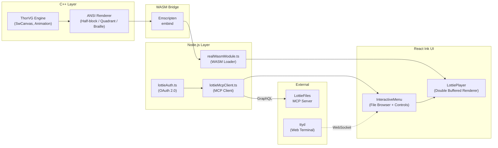
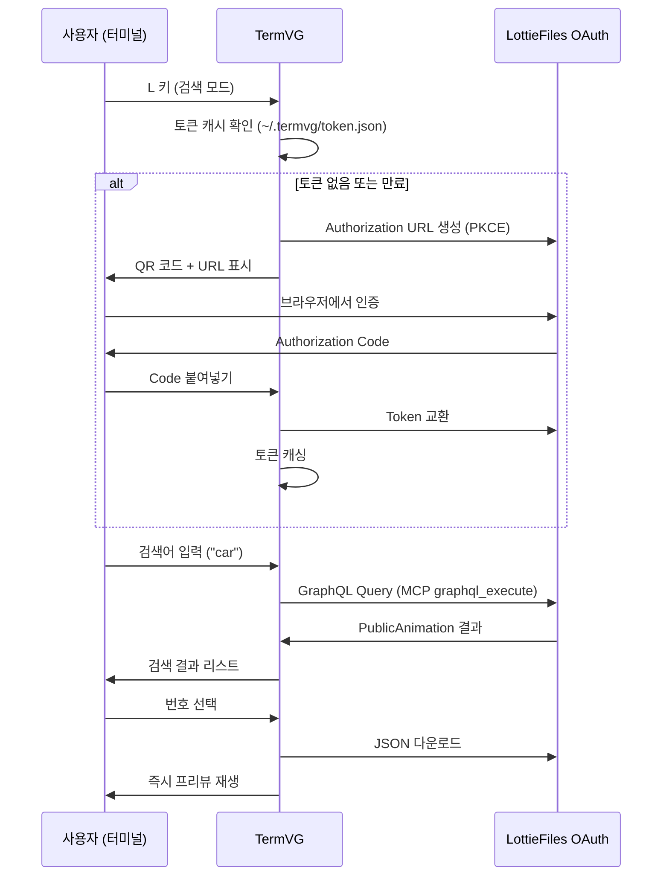

# 🚀 TermVG — Terminal Vector Graphics Player

> **ThorVG 기반 고성능 터미널 벡터 그래픽 플레이어**
>
> CLI 환경에서 Lottie 애니메이션과 SVG를 30fps로 실시간 렌더링합니다.

<!-- 아래 이미지 URL은 GitHub Issue에 업로드 후 교체하세요 -->
<!--  -->

---

## 📋 목차

- [핵심 기능](#-핵심-기능)
- [아키텍처](#-아키텍처)
- [설치 및 실행](#-설치-및-실행)
- [사용법](#-사용법)
- [렌더링 모드 비교](#-렌더링-모드-비교)
- [성능 벤치마크](#-성능-벤치마크)
- [LottieFiles MCP 연동](#-lottiefiles-mcp-연동)
- [트러블슈팅 하이라이트](#-트러블슈팅-하이라이트)
- [기술 스택](#-기술-스택)

---

## ✨ 핵심 기능

| 기능 | 설명 |
|------|------|
| **실시간 벡터 렌더링** | ThorVG C++ 엔진을 WebAssembly로 컴파일하여 터미널에서 네이티브급 성능으로 SVG/Lottie 렌더링 |
| **3가지 렌더링 모드** | Half-block, Quadrant(2×2), Braille(2×4) 문자를 활용한 터미널 해상도 극대화 |
| **파일 탐색기** | 디렉터리 재귀 스캔으로 SVG/Lottie 파일을 자동 탐지하고 트리 뷰로 표시 |
| **재생 제어** | Space로 일시정지/재생, ←→로 프레임 단위 시크(Seek) |
| **실시간 FPS 모니터** | WASM 렌더링 성능을 실시간 측정하여 색상 인디케이터로 표시 |
| **다크 모드 자동 적응** | Chroma Key + 색상 반전으로 검은 터미널 배경에서도 선명한 렌더링 |
| **더블 버퍼링** | Synchronized Output Mode로 애니메이션 깜빡임 제거 |
| **LottieFiles MCP 연동** | MCP 프로토콜 + OAuth 2.0으로 온라인 에셋 검색/다운로드/즉시 재생 |
| **웹 터미널 지원** | ttyd 연동으로 브라우저에서도 동일한 경험 제공 |
| **Graceful Shutdown** | SIGINT/SIGTERM/SIGHUP 시그널 처리로 WASM 메모리 안전 해제 |

---

## 🏗 아키텍처



### 렌더링 파이프라인

```
1. ThorVG C++ 엔진이 SVG/Lottie를 RGBA 픽셀 버퍼로 래스터라이즈
2. C++ ANSI 렌더러가 픽셀 → 유니코드 문자 + 256-color ANSI 이스케이프로 변환
3. Emscripten embind를 통해 ANSI 문자열을 JavaScript로 전달
4. React Ink가 터미널에 출력 (Synchronized Output Mode로 깜빡임 방지)
```

---

## 📦 설치 및 실행

### 요구사항
- Node.js 18+
- npm 또는 yarn

### 설치

```bash
git clone https://github.com/OSSCA-thorvg/Hackathon-Terminal_Vector_Graphics.git
cd Hackathon-Terminal_Vector_Graphics/react-wasm
npm install
```

### 실행

```bash
# 인터랙티브 모드 (파일 탐색기 + 프리뷰)
npx tsx src/index.tsx

# 단일 파일 재생
npx tsx src/index.tsx play assets/example.json

# 웹 터미널 (브라우저에서 접속)
npx tsx src/index.tsx web
# → http://localhost:8080 에서 접속
```

### 빌드

```bash
npm run build
node dist/index.js
```

---

## 🎮 사용법

### 키보드 단축키

| 키 | 동작 | 비고 |
|:---:|------|------|
| `↑` `↓` | 파일 목록 탐색 | |
| `←` `→` | 페이지 넘기기 | 재생 중일 때 |
| `←` `→` | 프레임 시크 | 일시정지 중일 때 |
| `Enter` | 파일 선택 | |
| `Space` | 재생 / 일시정지 | ⏸ PAUSED 표시 |
| `M` | 렌더링 모드 전환 | Quadrant → Braille → Half-block |
| `D` | 다크 모드 토글 | 어두운 색상 자동 반전 |
| `S` | 스캔 깊이 증가 | 하위 디렉터리 재귀 탐색 |
| `O` | 경로 직접 입력 | 디렉터리 경로 지정 |
| `L` | LottieFiles 검색 | MCP 연동 온라인 검색 |

### UI 구성

```
┌─ 28% Left Panel ──┐┌──── 72% Right Panel ────┐
│ Name: alien.json   ││ Live Preview ▶  30fps   │
│ 4.33s | 100.7kb    ││                         │
│ quadrant(M) ON(D)  ││   ┌─────────────────┐   │
│                    ││   │                 │   │
│ 📄 11555.json      ││   │   (Animation    │   │
│ 📄 16266.json      ││   │    Rendering)   │   │
│ 📂 effects/        ││   │                 │   │
│ 📄 fireworks.json  ││   └─────────────────┘   │
│ > 📄 alien.json    ││                         │
│                    ││                         │
│ Page 1/11 (155)    ││                         │
│ ↑↓ browse ←→ pages ││                         │
│ S:Scan L:LottieFiles││                        │
│ O:Open Path        ││                         │
└────────────────────┘└─────────────────────────┘
```

---

## 🎨 렌더링 모드 비교

TermVG는 터미널의 한계를 극복하기 위해 세 가지 유니코드 기반 렌더링 모드를 제공합니다.

| 모드 | 문자 | 셀당 해상도 | 특징 |
|------|------|:---:|------|
| **Half-block** | `▀` `▄` `█` | 1×2 px | 최고 색상 정확도, 기본 호환성 |
| **Quadrant** | `▖` `▗` `▘` `▝` `▞` `▟` ... | 2×2 px | 해상도/색상 균형, **기본값** |
| **Braille** | `⠁` `⠂` `⠄` `⡀` ... | 2×4 px | 최고 해상도, 단색(흑백) |

### 해상도 계산 예시 (80×40 터미널)

| 모드 | 유효 픽셀 해상도 | 배율 |
|------|:---:|:---:|
| Half-block | 80 × 80 | 1× |
| Quadrant | 160 × 80 | 2× |
| Braille | 160 × 160 | 4× |

> **렌더링 모드별 비교 스크린샷은 추후 추가 예정입니다.**

---

## 📊 성능 벤치마크

### 테스트 환경
- **CPU:** Apple M-series
- **Terminal:** iTerm2 (256-color, Synchronized Output 지원)
- **WASM:** Emscripten으로 컴파일된 ThorVG 0.15.x

### FPS 측정 결과

| 파일 | 용량 | 프레임 수 | Quadrant FPS | Braille FPS |
|------|:---:|:---:|:---:|:---:|
| 단순 아이콘 (alien.json) | 100KB | 120 | 30 fps 🟢 | 28 fps 🟢 |
| 중간 복잡도 (fireworks.json) | 9KB | 90 | 30 fps 🟢 | 30 fps 🟢 |
| 고복잡도 (10MB+) | 10MB | 300+ | 20~25 fps 🟡 | 15~20 fps 🟡 |

> FPS 색상 기준: 🟢 ≥25fps (쾌적) | 🟡 15~24fps (경고) | 🔴 <15fps (저하)

### 메모리 관리
- WASM 엔진 초기화: ~2MB
- Graceful Shutdown 시 `engine.delete()` 호출로 C++ 소멸자 명시 실행
- SIGINT/SIGTERM/SIGHUP 시그널 핸들링으로 좀비 프로세스 방지

---

## 🌐 LottieFiles MCP 연동

TermVG는 **Model Context Protocol (MCP)** 을 통해 LottieFiles 에셋을 CLI 환경에서 직접 검색하고 다운로드할 수 있습니다.

### 인증 플로우



### 검색 결과 메타데이터

```
🌐 LottieFiles 검색: car
  [1] Car Animation  by johndoe  ❤️ 245  ⬇️ 1.2K
  [2] Racing Car     by designer ❤️ 189  ⬇️ 890
  [3] Electric Car   by studio   ❤️ 312  ⬇️ 2.1K
```

- 다운로드 시 파일명은 `이름_by_작성자_ID.json` 형태로 자동 생성
- 저장 경로: `~/.termvg/downloads/`

---

## 🔧 트러블슈팅 하이라이트

개발 과정에서 해결한 16가지 기술적 과제 중 핵심 3가지를 소개합니다.

### 1. 터미널 더블 버퍼링 (깜빡임 제거)

**문제:** 매 프레임마다 Ink의 Clear→Write 2-Pass로 인한 깜빡임

**시도 1 (실패):** `process.stdout.write`로 커서를 직접 이동하여 덮어쓰기
→ Ink 레이아웃 시스템과 충돌하여 화면 깨짐

**시도 2 (성공):** DEC Private Mode `\x1b[?2026h/l` (Synchronized Output)
→ 터미널이 출력을 버퍼링하고 한 번에 플러시, Clear 단계가 사용자에게 보이지 않음

### 2. ESM/CJS 모듈 충돌 해결

**문제:** Emscripten이 생성한 `termvg.js`가 CommonJS인데 `"type": "module"` 프로젝트에서 `require()` 불가

**해결:** `.cjs` 확장자로 명시적 분리 + `createRequire(import.meta.url)`로 ESM 내 CommonJS 로딩

### 3. MCP 응답 구조 파싱

**문제:** `result.content[0].text`를 JSON 파싱하면 에러 (`"GraphQL response returned."`)

**해결:** 실제 데이터는 `result.structuredContent.data`에 이미 파싱된 객체로 존재
→ SDK의 Structured Content 규격을 이해하고 올바른 경로로 접근

> 📖 전체 트러블슈팅 기록 (16건)은 [termvg_troubleshooting.md](./termvg_troubleshooting.md)에서 확인할 수 있습니다.

---

## 🛠 기술 스택

| 영역 | 기술 | 역할 |
|------|------|------|
| **렌더링 엔진** | ThorVG (C++) | SVG/Lottie 래스터라이징 |
| **컴파일** | Emscripten (WASM) | C++ → WebAssembly 크로스 컴파일 |
| **바인딩** | embind | C++ ↔ JavaScript 함수 바인딩 |
| **런타임** | Node.js 18+ | WASM 호스팅 + 파일시스템 접근 |
| **UI 프레임워크** | React + Ink v5 | 선언적 터미널 UI |
| **프로토콜** | MCP (Model Context Protocol) | LottieFiles API 연동 |
| **인증** | OAuth 2.0 + PKCE | LottieFiles 인증 |
| **웹 터미널** | ttyd | 브라우저 기반 터미널 접근 |
| **언어** | TypeScript + C++ | 타입 안전성 + 네이티브 성능 |

---

## 📄 라이선스

이 프로젝트는 [ThorVG OSSCA 해커톤](https://github.com/thorvg)의 일환으로 제작되었습니다.

---

<p align="center">
  <b>TermVG</b> — 터미널의 한계를 넘어, 벡터 그래픽의 가능성을 열다.
</p>
